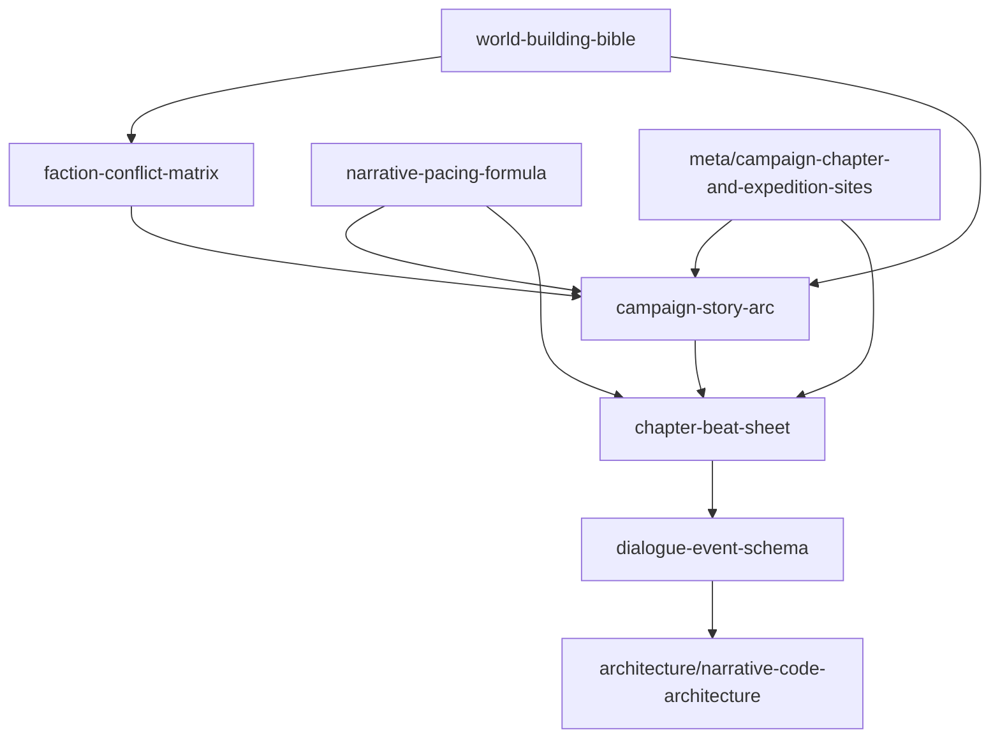

# 내러티브 설계 인덱스

- 상태: draft
- 소유자: repository
- 최종수정일: 2026-04-10
- 소스오브트루스: `docs/02_design/narrative/index.md`
- 관련문서:
  - `docs/02_design/index.md`
  - `docs/02_design/meta/campaign-chapter-and-expedition-sites.md`
  - `docs/03_architecture/narrative-code-architecture.md`

## 목적

내러티브 문서군의 진입점과 source of truth 경계를 정의한다. 이 문서는 narrative 문서 간 의존관계와 작성 순서를 고정한다.

## 문서군 개요

이 폴더는 세계관, 감정 곡선, 캠페인 서사 아크, 노드 비트, 대사/이벤트 스키마, 세력 충돌 관계를 소유한다. site/node topology, encounter family, answer lane, mechanical reward cadence는 `docs/02_design/meta/campaign-chapter-and-expedition-sites.md`가 소유하며, narrative 문서는 해당 ID를 참조만 한다. 영웅 canon shortform과 roster 확장 로드맵은 `docs/02_design/deck/`가 소유한다.

## 문서 목록

| path | purpose | owns_truth | depends_on | depended_by |
|---|---|---|---|---|
| `world-building-bible.md` | 세계관 바이블 | 불변 세계관 진실, 세력, 지리, 연대기, 명명 규칙 | — | `campaign-story-arc.md`, `faction-conflict-matrix.md`, `docs/02_design/deck/character-lore-registry.md` |
| `narrative-pacing-formula.md` | 페이싱 공식 | 감정 곡선, session cadence, reveal timing | — | `campaign-story-arc.md`, `chapter-beat-sheet.md`, `docs/02_design/meta/story-gating-and-unlock-rules.md` |
| `faction-conflict-matrix.md` | 세력 충돌 행렬 | faction pair별 오해/진실/충돌축/encounter link | `world-building-bible.md` | `campaign-story-arc.md`, `docs/02_design/deck/hero-expansion-roadmap.md` |
| `campaign-story-arc.md` | 캠페인 전체 아크 | 로그라인, chapter 목적, 갈등 해소율, 엔딩/후속작 hook | `world-building-bible.md`, `narrative-pacing-formula.md`, `faction-conflict-matrix.md`, `docs/02_design/meta/campaign-chapter-and-expedition-sites.md` | `chapter-beat-sheet.md`, `docs/02_design/deck/hero-expansion-roadmap.md` |
| `chapter-beat-sheet.md` | node별 비트 SoT | chapter/site/node별 beat, reveal, emotion target, join timing | `campaign-story-arc.md`, `narrative-pacing-formula.md` | `dialogue-event-schema.md` |
| `dialogue-event-schema.md` | 대사/이벤트 스키마 | story_event_id, trigger, once policy, presentation grade, authoring 규칙 | `chapter-beat-sheet.md` | `docs/03_architecture/narrative-code-architecture.md` |

## 문서 의존 그래프

## 작성 순서

1. `world-building-bible.md` — 세계 전제, 세력, 연대기가 확정되어야 다음 문서가 시작된다.
2. `faction-conflict-matrix.md` — 세력 쌍별 충돌이 확정되어야 campaign arc의 갈등 추이를 쓸 수 있다.
3. `narrative-pacing-formula.md` — 감정 곡선과 session cadence가 확정되어야 beat와 gating을 쓸 수 있다.
4. `campaign-story-arc.md` — chapter 목적과 hook 상태가 확정되어야 node beat를 쓸 수 있다.
5. `chapter-beat-sheet.md` — node별 beat와 감정값이 확정되어야 event schema를 쓸 수 있다.
6. `dialogue-event-schema.md` — event ID와 authoring 규칙이 확정되어야 코드 구현이 시작된다.

## source of truth 경계

- 세계관 truth는 `world-building-bible.md`가 소유한다.
- chapter purpose와 hook 상태는 `campaign-story-arc.md`가 소유한다.
- node 단위 감정값과 비트는 `chapter-beat-sheet.md`가 소유한다.
- event ID와 authoring 규칙은 `dialogue-event-schema.md`가 소유한다.
- site topology와 encounter lane은 `docs/02_design/meta/campaign-chapter-and-expedition-sites.md`가 소유한다.
- hero canon과 tier는 `docs/02_design/deck/character-lore-registry.md`가 소유한다.

## 변경 시 체크리스트

- 새 chapter/site/node ID를 추가했는가
- 관련 index.md를 갱신했는가
- DAG와 표가 일치하는가
- SoT 중복이 생기지 않는가
